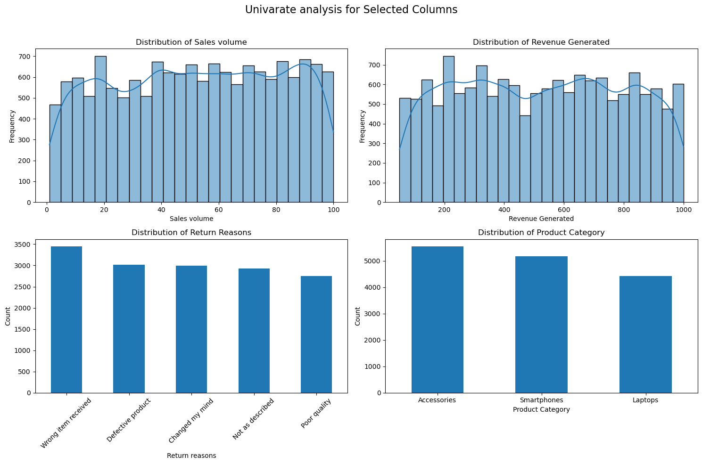
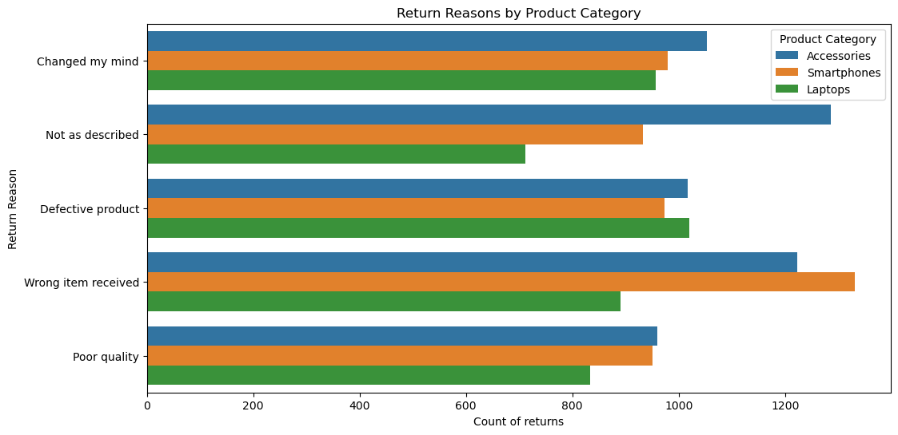

# TechTrend Pro: Product Quality and Return Analysis

## Background and Overview
### Project Background

TechTrend Pro is a global e-commerce company specializing in electronics and gadgets retail. Established as a prominent player in the online electronics market, the company serves tech-savvy consumers through its comprehensive product catalog including smartphones, laptops, and accessories. 

Despite its market success, TechTrend Pro faces critical challenges with elevated return rates that impact both profitability and customer satisfaction.

This analysis aims to uncover the root causes of these returns by examining product quality metrics, customer feedback, and sales data.

## Business Problem

#### The company experiences significant operational challenges including:

- Elevated return rates across specific product categories, particularly smartphones and laptops
- Substantial operational costs from return processing, restocking, and customer support
- Lack of systematic analysis connecting product quality metrics to return patterns
- Inefficient resource allocation due to reactive rather than proactive return management

## Project Objectives

#### This analysis provides TechTrend Pro with data-driven insights to:

- Identify patterns in historical return data and their relationship to product quality indicators
- Quantify the impact of product quality on return rates across different categories
- Develop actionable recommendations for product development and sourcing optimization
- Enable proactive quality management to reduce operational costs and improve customer satisfaction

[You can find the full technical analysis and code here](TechTrendsPro/TechTrendsPro.ipynb)

[And sql directories here](Tech_trend_product_analysis/Tech_trend_product_analysis.docx)

## Data Structure Overview

### Product Table
| Column | Data Type | Description |
|--------|-----------|-------------|
| Product ID | Integer | Primary key - unique identifier for each product |
| Product Category | Text | Product classification (Smartphones, Laptops, Accessories) |
| Product Attributes | Text | Product specifications and quality-related features |

**Records:** 200 entries

---

### Sales Table
| Column | Data Type | Description |
|--------|-----------|-------------|
| Sale ID | Integer | Primary key - unique identifier for each sales transaction |
| Product ID | Integer | Foreign key - reference to Product Table |
| Sales Date | Date | Date when the product was sold |
| Sales Volume | Integer | Number of units sold in the transaction |
| Revenue Generated | Double | Total revenue generated from the sale in USD |

**Records:** 2,000 entries

---

### Feedback Table
| Column | Data Type | Description |
|--------|-----------|-------------|
| Feedback ID | Integer | Primary key - unique identifier for each feedback entry |
| Product ID | Integer | Foreign key - reference to Product Table |
| Return Date | Date | Date when the product was returned |
| Return Reason | Text | Customer-provided reason for return (5 categories) |
| Customer Feedback | Text | Additional customer comments about product experience |

**Records:** 1,500 entries

---

### Data Relationships
- **One-to-Many**: Each product can have multiple sales transactions
- **One-to-Many**: Each product can have multiple return/feedback entries
- **Join Key**: Product ID links all three tables

### Analysis Tools:

- SQL (MySQL): Data preprocessing, cleaning, and transformation
- Python: Statistical analysis, visualization, and insight generation
- Libraries: pandas, numpy, matplotlib, seaborn, scipy
- Statistical Methods: Chi-square test of independence, descriptive analytics

## Executive Summary

#### Overview of Findings

Analysis of 15,121 combined transaction and return records reveals significant quality-related patterns driving return behavior. Statistical analysis confirms a significant relationship between product categories and quality issues **(χ² = 6.56, p = 0.038)**, indicating that return patterns are not uniformly distributed across TechTrend Pro's product portfolio.

## Critical Insights:

- **Quality Issues Distribution:** Quality-related returns show statistically significant variation across product categories **(χ² = 6.56, p = 0.038)**
- **Primary Return Driver:** "Wrong item received" represents the highest return frequency, followed by quality-related issues
- **Category Performance:** Accessories show the highest return volume, while laptops demonstrate concerning quality issue rates relative to sales volume
- **Revenue Impact:** Returns directly affect operational efficiency and customer satisfaction metrics

- **Business Impact:** The analysis indicates immediate opportunities for targeted quality improvements, particularly in high-volume categories, potentially reducing operational costs and improving customer retention.

## Insights Deep Dive

## Return Pattern Analysis
##### Return Reason Distribution:

- **Wrong Item Received (22.1%):** Highest frequency, indicating fulfillment process issues
- **Not as Described (19.9%):** Product description accuracy concerns
- **Defective Product (19.8%):** Direct quality manufacturing issues
- **Changed Mind (19.8%):** Customer preference changes
- **Poor Quality (18.4%):** Explicit quality dissatisfaction

### Statistical Validation of Quality Relationships

#### Chi-Square Test Results:

- **Test Statistic:** χ² = 6.559
- **p-value:** 0.038 (statistically significant at α = 0.05)
Conclusion: Product categories and quality issues are not independently distributed

This statistical significance indicates that quality issues cluster differently across product categories, validating the need for category-specific intervention strategies.

## Category-Specific Findings:
#### Accessories (Highest Volume Category) 

- Represents largest portion of returns (35.7% of all returns)
- Quality issues present but proportionally lower than other categories
- Primary concern: fulfillment accuracy

#### Smartphones (Moderate Quality Issues)

- Balanced distribution of return reasons
- Notable "defective product" returns requiring supplier review
- Revenue per unit higher, making quality improvements critical

#### Laptops (Quality-Intensive Category)

- Lower total volume but higher quality issue concentration
- "Defective product" returns disproportionately high
- Highest revenue impact per return event

## Revenue and Operational Impact
#### Sales Performance Context:

- Average revenue per sale: $519.68
- Average sales volume: 52 units per transaction
- Quality-related returns represent 18.0% of all feedback entries

The combination of high-value transactions and quality-related returns creates significant operational cost burden requiring strategic intervention.

## Recommendations
#### Immediate Actions (0-3 months)

#### Enhanced Quality Control Implementation
- Deploy stricter incoming inspection protocols for laptop and smartphone categories
- Implement batch quality testing for high-return product lines
- Establish quality scorecards for all suppliers with monthly performance reviews

#### Fulfillment Process Optimization

- Review and upgrade order picking and packing procedures to reduce "wrong item" returns
- Implement double-check protocols for high-value orders (>$500)
- Deploy barcode scanning validation at multiple fulfillment checkpoints

### Strategic Initiatives (3-12 months)
#### Supplier Relationship Management

- Negotiate quality performance clauses with suppliers showing elevated return rates
- Establish supplier quality audit programs for categories exceeding 15% quality-related returns
- Develop alternative supplier pipeline for critical product categories

#### Data-Driven Product Development

- Utilize customer feedback patterns to inform product specification requirements
- Implement predictive quality scoring for new product evaluation
- Establish quality threshold gates for product category expansion

#### Customer Experience Enhancement

- Develop category-specific product education materials to reduce "not as described" returns
- Implement proactive customer support outreach for quality-sensitive purchases
- Create quality assurance communication protocols for high-risk orders

### Long-term Strategic Framework (12+ months)
#### Predictive Analytics Development

- Build machine learning models to predict quality issues before shipment
- Implement early warning systems for supplier quality degradation
- Develop customer satisfaction prediction models based on purchase patterns

#### Operational Excellence Program

- Establish continuous improvement framework for return rate reduction
- Implement cross-functional quality teams spanning procurement, operations, and customer service
- Create quality performance dashboards for executive visibility
ed
Duplicate detection and removal protocols implemented
